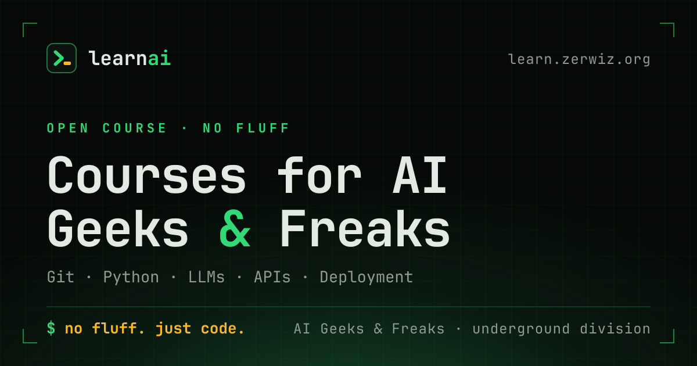

# learnai

**Courses for AI geeks & freaks.** Hands-on, no fluff, no lectures. We build
real things, break them, fix them, and learn by doing.

[](https://learn.zerwiz.org)
[](./LICENSE)
[](https://nextjs.org)
[](./CONTRIBUTING.md)

- **Live site:** <https://learn.zerwiz.org>
- **Part of:** [AI Geeks & Freaks](https://aigeeksnfreaks.zerwiz.org)
- **Support:** [buy us a coffee](https://ko-fi.com/zerwiz)

---

## What this is

A course site for people getting into coding with AI — from zero to building and
shipping. Every lesson carries code you can run, break, and improve, and the
site's **live playground** puts a real model behind the page so you can poke at
one without writing a line of setup first.

Who it's for:

- **AI geeks** who want to know what's under the hood
- **Freaks** — the curious, the stubborn, the ones who tinker at 2 AM
- **Beginners** — no prior coding needed, just willingness to try

Who it's not for: anyone who wants a certificate, a lecture, or a hand held.

---

## The course

**5 tracks · 24 lessons.**

| # | Track | Lessons | What you walk away with |
|---|-------|---------|--------------------------|
| 01 | **Git & GitHub** | 6 | Move code around safely — repos, forks, branches, small focused PRs |
| 02 | **Python for AI** | 5 | Environments, data structures, reading docs and errors without panic |
| 03 | **Talking to Models** | 5 | REST & JSON, OpenAI-compatible endpoints, prompting, streaming, errors |
| 04 | **Building with AI** | 4 | A CLI tool, a web app with a model backend, deployment, auth |
| 05 | **Going Deeper** | 4 | Local models, fine-tuning, agents/tools/MCP, your own project |

<details>
<summary>All 24 lessons</summary>

**01 · Git & GitHub** — Making Your First Repo · Cloning: SSH vs HTTPS ·
Forking & Upstream · Syncing a Fork · Branching & Pull Requests ·
Small, Focused PRs

**02 · Python for AI** — Setup: Python, pip, venv · Basics: Variables, Loops,
Functions · Data Structures: Lists, Dicts, JSON · Reading Docs & Errors ·
Installing & Using Packages

**03 · Talking to Models** — What is an API? REST & JSON · OpenAI-Compatible
Endpoints · Prompting: Writing Good Instructions · Building a Chat App ·
Streaming & Error Handling

**04 · Building with AI** — CLI Tool That Talks to a Model · Web App with Model
Backend · Deploying to Cloudflare Pages · Auth & Going Public

**05 · Going Deeper** — Running Models Locally · Fine-Tuning & Prompt
Engineering · Agents, Tools & MCP · Build Your Own AI Project

</details>

The whole syllabus lives in one file: [`src/lib/course-data.ts`](./src/lib/course-data.ts).
Read [PLANNING.md](./PLANNING.md) for the longer-range plan.

---

## The live playground

Three tabs, each backed by a real service — and an honest error when one isn't
configured. No mocked responses anywhere.

| Tab | Backend | Configured by |
|-----|---------|---------------|
| **chat** | Any OpenAI-compatible chat endpoint; streams token-by-token over SSE | `LLM_BASE_URL`, `LLM_API_KEY`, `LLM_MODEL` |
| **image** | Any OpenAI-compatible images endpoint | `IMAGE_BASE_URL`, `IMAGE_API_KEY`, `IMAGE_MODEL` |
| **search** | `searxng` \| `brave` \| `tavily` \| `custom` | `SEARCH_PROVIDER`, `SEARCH_API_URL`, `SEARCH_API_KEY` |

Your API key never reaches the browser: the browser calls a Next.js route, which
calls the provider server-side. Point `LLM_BASE_URL` at anything OpenAI-shaped —
a hosted API or a local `llama.cpp` / llama-swap rail.

---

## Stack

| | |
|---|---|
| Framework | Next.js 16 (App Router, Turbopack), React 19, TypeScript 5 |
| Styling | Tailwind CSS 4, shadcn/ui + Radix primitives, lucide-react, framer-motion |
| Theming | next-themes — dark by default |
| Data | Prisma 6 + SQLite (bundled schema) |
| Runtime | [Bun](https://bun.sh) |

---

## Quick start

```bash
git clone https://github.com/zerwiz/learnai.git
cd learnai
bun install
cp .env.example .env      # fill in what you need; the playground is optional
bun run db:generate
bun run dev               # http://localhost:3000
```

No API keys? The site, all 24 lessons, and the playground shell still work — the
three live tabs simply report that they aren't configured.

### Scripts

| Command | Does |
|---------|------|
| `bun run dev` | Dev server on `:3000` |
| `bun run build` | Production build (standalone output) |
| `bun run start` | Serve the standalone build |
| `bun run lint` | ESLint |
| `bun run db:generate` / `db:push` / `db:migrate` | Prisma |

### Environment

See [`.env.example`](./.env.example) for the full list. Nothing is required to
run the site; the playground tabs light up per-provider.

| Variable | Purpose |
|----------|---------|
| `NEXT_PUBLIC_SITE_URL` | Canonical origin for metadata, sitemap, robots |
| `NEXT_PUBLIC_SUPPORT_URL` | Tip jar shown in the footer and community card |
| `DATABASE_URL` | SQLite path |
| `LLM_BASE_URL` · `LLM_API_KEY` · `LLM_MODEL` | The chat tab |
| `IMAGE_BASE_URL` · `IMAGE_API_KEY` · `IMAGE_MODEL` | The image tab |
| `SEARCH_PROVIDER` · `SEARCH_API_URL` · `SEARCH_API_KEY` | The search tab |

---

## Project layout

```
brand/                  SVG sources for the mark and the OG plate
public/                 served assets — favicon, icons, og.png (generated)
scripts/                generate-brand-assets.sh
src/app/                routes: page, layout, manifest, robots, sitemap
src/app/api/playground/ the three live-tab routes
src/components/learnai/ the site's own components
src/components/ui/      shadcn/ui primitives
src/lib/course-data.ts  THE SYLLABUS — tracks and lessons
src/lib/site.ts         outbound links, one source of truth
prisma/                 schema
```

### Brand assets

The favicon, PWA icons, and OG plate are generated, not hand-drawn:

```bash
./scripts/generate-brand-assets.sh    # brand/*.svg -> public/
```

Requires `rsvg-convert` and ImageMagick.

---

## Deploy

The site runs on a small server behind a Cloudflare tunnel. The full runbook —
systemd unit, tunnel ingress, redeploy — is in [DEPLOY.md](./DEPLOY.md).

---

## Contributing

Issues and pull requests are welcome. The loop is deliberately small:

```
fork → branch → commit → push → PR
```

Read [CONTRIBUTING.md](./CONTRIBUTING.md) for the dev setup, the code style, and
how to add a lesson. Start with a
[good first issue](https://github.com/zerwiz/learnai/issues) or open a
[lesson idea](https://github.com/zerwiz/learnai/issues/new/choose).

This project is governed by a [Code of Conduct](./CODE_OF_CONDUCT.md). By taking
part, you agree to uphold it.

---

## Support

The course is free and stays free. If it helped, buy us a coffee:

**<https://ko-fi.com/zerwiz>**

## License

[MIT](./LICENSE) © 2026 zerwiz
